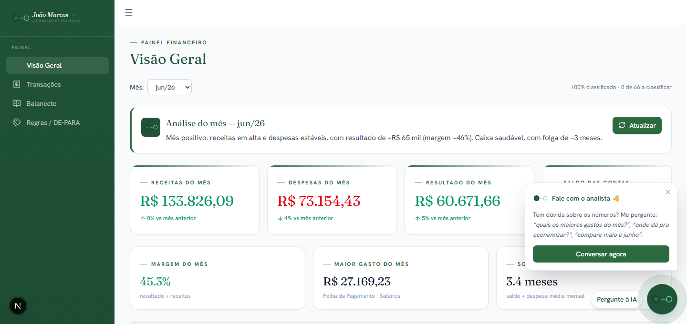
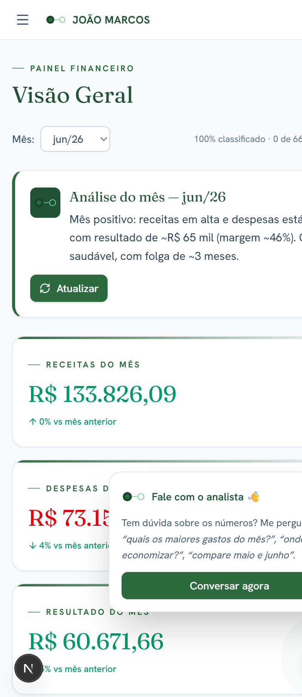

<p align="center">
  
</p>

<h1 align="center">Painel Financeiro</h1>

<p align="center">
  <strong>Do extrato bancário à decisão — automático, com IA e pronto pro celular.</strong>
</p>

<p align="center">
  <a href="https://painel-joao-marcos.vercel.app"><strong>🔗 Ver demo ao vivo</strong></a>
  &nbsp;·&nbsp; <em>dados fictícios · abre sem login</em>
</p>

---

Dashboard que **conecta no Open Finance, classifica cada movimento e monta o balancete sozinho** —
com KPIs, gráficos, análise por Inteligência Artificial e um chat para perguntar sobre os números
em linguagem natural.

> 💼 **Projeto de demonstração / portfólio.** Sem dados reais — credenciais ficam em variáveis de
> ambiente (nada sensível é versionado).

## 🖼️ Demonstração

<p align="center">
  
</p>
<p align="center">
  
  &nbsp;&nbsp;<em>↳ responsivo: o mesmo painel no celular</em>
</p>

🔗 **Demo ao vivo:** <https://painel-joao-marcos.vercel.app> — dados 100% fictícios, abre sem login.
No demo a IA responde com exemplos prontos (**custo zero**, sem chave).

## ✨ Funcionalidades

- 📈 **Visão Geral** — receitas, despesas, resultado e saldo do mês, evolução e maiores gastos.
- 📒 **Balancete automático** — montado por conta × mês (substitui a planilha manual).
- 🔎 **Transações** — todos os movimentos, filtráveis e pesquisáveis.
- 🏷️ **Classificação inteligente (DE-PARA)** — regras por contraparte/CNPJ/palavra/categoria; o resíduo vira regra com 1 clique.
- 🔄 **Open Finance** — importa o extrato automaticamente (manual ou agendado).
- 🤖 **Análise por IA** — comentário automático em cada gráfico + chat sobre as finanças.
- 📱 **Pronto pro celular** — layout responsivo; abre no navegador do telefone como um app.
- 🔐 **Login seguro** — autenticação via Google Workspace (SSO).

## 🛠️ Tecnologias

| Camada | Stack |
|---|---|
| Front + Back | **Next.js 16** (App Router) · React 19 · TypeScript |
| Estilo | Tailwind CSS v4 |
| Gráficos | Recharts |
| Banco de dados | PostgreSQL (Supabase) |
| Extrato bancário | API Open Finance (Autmais) |
| Inteligência Artificial | Claude (Anthropic) |
| Deploy | Vercel |

## ⚙️ Como funciona

1. **Sincroniza** o extrato via Open Finance e grava no banco (idempotente).
2. **Classifica** cada movimento por um motor de regras.
3. **Monta** o balancete e os indicadores do mês.
4. **Comenta** com IA e responde no chat — sempre baseado nos números.

Toda configuração sensível (banco, credenciais, chaves de IA) é injetada por **variáveis de ambiente**
— veja [`.env.example`](.env.example). Nenhum segredo fica no código.

## 🚀 Rodando localmente

```bash
npm install
cp .env.example .env.local    # preencha os valores
npm run dev                   # http://localhost:3000
```

**Modo demonstração** (dados fictícios, sem login, IA com respostas prontas):

```bash
node scripts/seed-demo.mjs                          # popula dados fictícios
DEMO_MODE=1 NEXT_PUBLIC_DEMO_MODE=1 npm run dev      # abre sem login
```

## 🔐 Segurança

- Credenciais **somente em `.env.local`** / variáveis do servidor — **nunca** no repositório.
- Acesso ao banco apenas pelo servidor.
- Login obrigatório nas rotas protegidas.

## 📬 Contato

Feito por **João Marcos — Automação de Processos** · [joaomarcosautomacoes.com.br](https://joaomarcosautomacoes.com.br)
