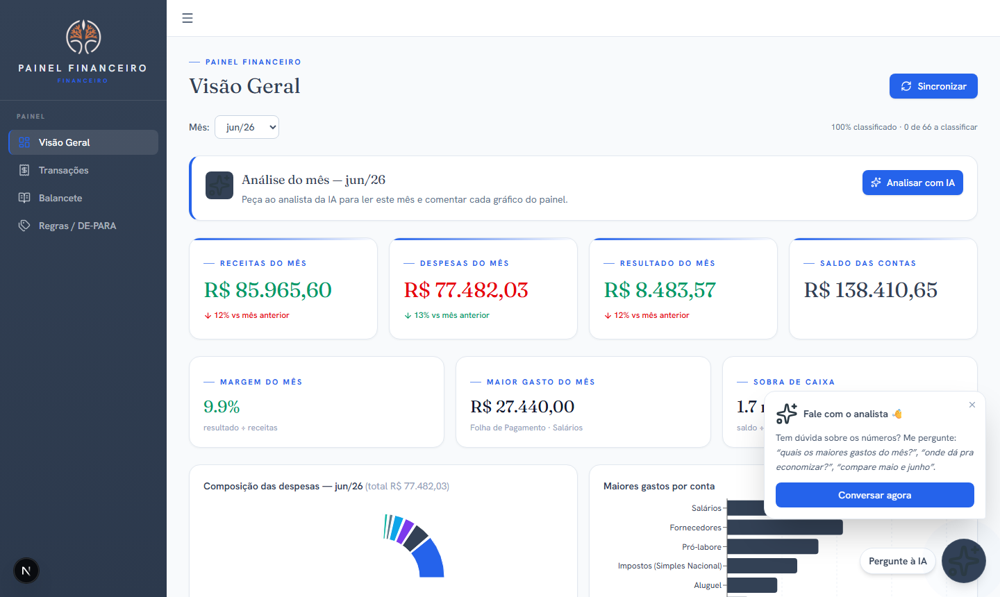

# 📊 Painel Financeiro

> Dashboard de gestão financeira que transforma o extrato bancário em decisão — automático, com IA e pronto pro celular.

<p align="center">
  <a href="https://painel-joao-marcos.vercel.app"><strong>🔗 Ver demo ao vivo</strong></a>
  &nbsp;·&nbsp; <em>dados fictícios · abre sem login</em>
</p>

Aplicação web que **conecta no Open Finance, organiza cada movimento e monta o balancete sozinho**,
apresentando tudo em dashboards claros, com análises por Inteligência Artificial e um chat para
perguntar sobre os números em linguagem natural.

> 💼 **Projeto demonstrativo / portfólio.** Não contém dados reais — todas as credenciais ficam em
> variáveis de ambiente (nada sensível é versionado).

---

## ✨ O que ele faz

- **📈 Visão Geral** — receitas, despesas, resultado e saldo do mês, evolução e maiores gastos, num relance.
- **📒 Balancete automático** — balancete gerencial montado por conta × mês (substitui a planilha manual).
- **🔎 Transações** — todos os movimentos, filtráveis e pesquisáveis.
- **🏷️ Classificação inteligente (DE-PARA)** — cada lançamento é categorizado por regras (contraparte/CNPJ/palavra/categoria); o resíduo vira regra com 1 clique.
- **🔄 Sincronização Open Finance** — importa o extrato automaticamente (manual ou agendado), sem digitação.
- **🤖 Análise com IA** — comentários automáticos em cada gráfico + chat: _"quais os maiores gastos?"_, _"onde dá pra economizar?"_, _"compare maio e junho"_.
- **📱 Pronto pro celular** — layout responsivo; abre no navegador do telefone como um app.
- **🔐 Login seguro** — autenticação via Google Workspace (SSO).

---

## 🖼️ Demonstração

<p align="center">
  
</p>

<p align="center">
  
  &nbsp;&nbsp;<em>↳ responsivo: mesmo painel no celular</em>
</p>

> **🔗 Demo ao vivo:** <https://painel-joao-marcos.vercel.app> — dados 100% fictícios, abre sem login.

Há um **modo demonstração** com dados 100% fictícios (nenhum dado real):

```bash
# com o banco configurado no .env.local:
node scripts/seed-demo.mjs     # popula dados fictícios
DEMO_MODE=1 npm run dev         # abre sem exigir login → http://localhost:3000
```

---

## 🛠️ Tecnologias

| Camada | Stack |
|---|---|
| Front + Back | **Next.js 16** (App Router) · React 19 · TypeScript |
| Estilo | Tailwind CSS v4 |
| Gráficos | Recharts |
| Banco de dados | PostgreSQL (Supabase) |
| Extrato bancário | API Open Finance (Autmais) |
| Inteligência Artificial | Claude (Anthropic) |
| Deploy | Vercel |

---

## ⚙️ Como funciona

1. **Sincroniza** o extrato via Open Finance e grava no banco (idempotente).
2. **Classifica** cada movimento por um motor de regras (com fila de "a classificar").
3. **Monta** o balancete e os indicadores do mês.
4. **Comenta** com IA e responde no chat — sempre baseado nos seus números.

Toda configuração sensível (banco, credenciais, chaves de IA) é injetada por **variáveis de ambiente**
— veja [`.env.example`](.env.example). Nenhum segredo fica no código.

---

## 🚀 Rodando localmente

```bash
npm install
cp .env.example .env.local   # preencha com suas credenciais
npm run dev                  # http://localhost:3000
```

---

## 🔐 Segurança

- Credenciais **somente em `.env.local`** / variáveis do servidor — **nunca** no repositório.
- Acesso ao banco apenas pelo servidor.
- Login obrigatório nas rotas protegidas.

---

## 📬 Contato

Quer um painel assim para o seu escritório ou empresa? **Vamos conversar.**
<!-- adicione aqui: e-mail · LinkedIn · site -->
